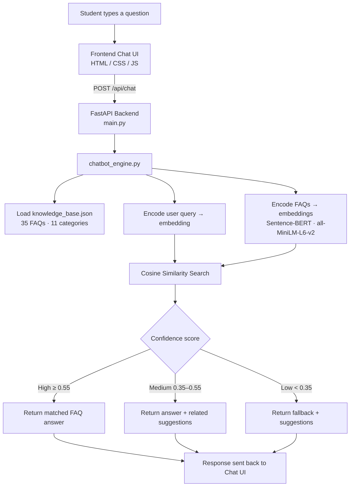
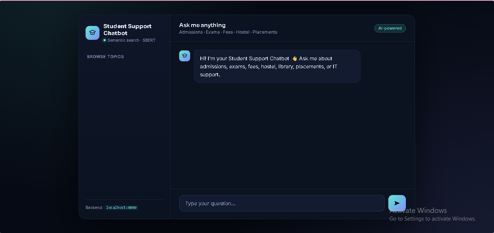
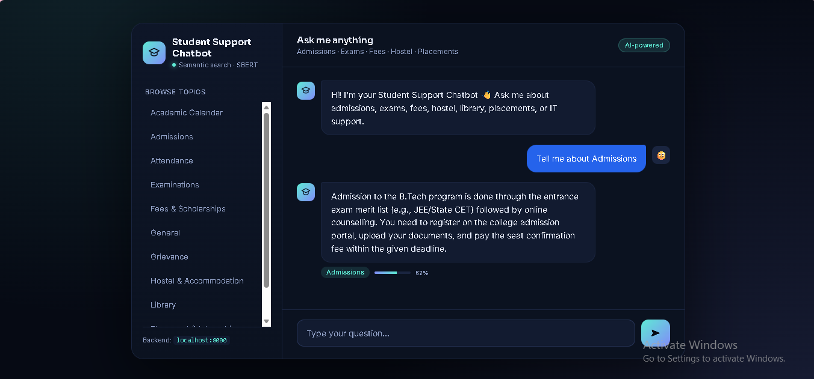
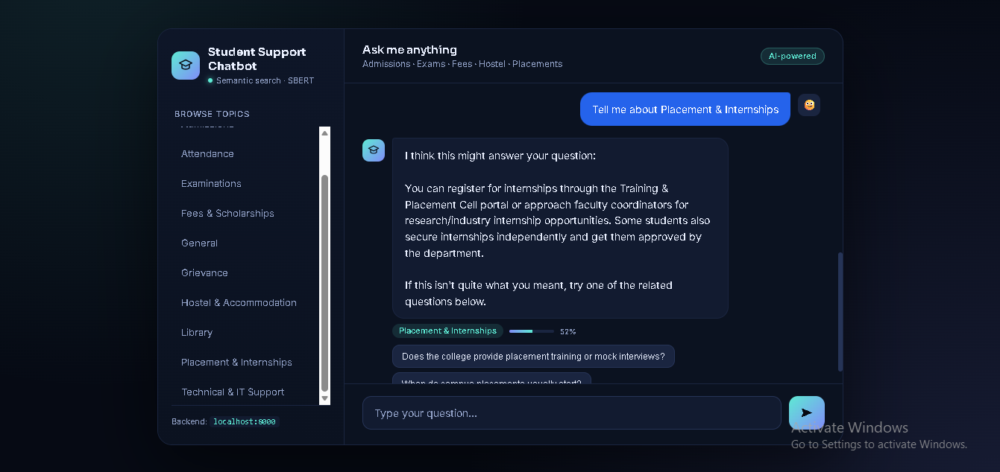

# 🎓 Student Support Chatbot

### AI-Powered Chatbot for Student Support Services using Semantic Search (Sentence-BERT)

An internship project that builds an intelligent chatbot capable of answering
common student queries — admissions, examinations, fees, hostel, library,
placements, and IT support — by understanding the *meaning* of a question
rather than relying on rigid keyword matching.

---

## 📌 Internship Details

| Field | Detail |
|---|---|
| **Submitted by** | Aayushi Sharma |
| **College** | Moradabad Institute of Technology |
| **Program** | B.Tech, Computer Science Engineering (AI & ML) |
| **Internship Domain** | Artificial Intelligence |
| **Company / Organization** | *(add here)* |
| **Duration** | *(add here)* |
| **Mentor** | *(add here)* |

---

## 1. 📖 Problem Statement

College students repeatedly ask the same category of questions — attendance
rules, fee deadlines, hostel allotment, placement eligibility — to
already-overloaded administrative staff. This project builds a chatbot that
can instantly answer these queries by understanding the intent behind a
question, so differently-worded queries (e.g. *"How much attendance do I
need?"* vs *"What if my attendance is low?"*) still route to the correct
answer.

## 2. 🎯 Objective

- Design and implement an AI-based conversational assistant for a college's
  student support desk.
- Use NLP embeddings (Sentence-BERT) to enable **semantic understanding**
  instead of exact keyword matching.
- Build a working end-to-end system: backend API, NLP engine, and a chat
  interface, following a real-world client-server architecture.

## 3. 🧠 Why This Is an AI Project (Not a Rule-Based Bot)

| Traditional keyword bot | This project |
|---|---|
| `if "hostel" in message:` style rules | Encodes both the FAQ and the user query into dense semantic vectors using a pretrained **Sentence-BERT transformer** |
| Breaks on rephrasing, typos, or synonyms | Understands meaning via **cosine similarity** in embedding space |
| Always returns *some* answer, even if wrong | Returns a **confidence score**; low-confidence queries trigger a graceful fallback with alternative suggestions instead of guessing |

This mirrors the same embedding + similarity-search pattern used in
production RAG pipelines and semantic search systems, scoped down to a
system that's straightforward to explain and demo.

## 4. 🏗️ System Architecture



**Reliability fallback:** if the Sentence-BERT model can't be downloaded
(e.g. no internet on first run), `chatbot_engine.py` automatically falls
back to a TF-IDF vector space model (scikit-learn) so the system still works
end-to-end. Worth mentioning in your report as a deliberate design decision.

## 5. 🛠️ Tech Stack

| Layer | Technology |
|---|---|
| Backend | Python, FastAPI, Uvicorn |
| AI / NLP | `sentence-transformers` (`all-MiniLM-L6-v2`), NumPy, scikit-learn (TF-IDF fallback) |
| Frontend | HTML, CSS, vanilla JavaScript |
| Data | JSON-based knowledge base (35 FAQs across 11 categories) |

## 6. 📁 Project Structure

```
student-support-chatbot/
├── backend/
│   ├── main.py                 # FastAPI app & routes
│   ├── chatbot_engine.py       # Embedding + semantic search logic
│   ├── requirements.txt
│   └── data/
│       └── knowledge_base.json # FAQ dataset
├── frontend/
│   └── index.html              # Chat UI
├── screenshots/                # UI & conversation screenshots (for README)
└── README.md
```

## 7. ⚙️ Setup & Installation

### Backend

```bash
cd backend
python -m venv venv
source venv/bin/activate        # Windows: venv\Scripts\activate
pip install -r requirements.txt
uvicorn main:app --reload --port 8000
```

The first run downloads the `all-MiniLM-L6-v2` model (~80MB) from Hugging
Face — needs an internet connection once, then it's cached locally.

### Frontend

Open `frontend/index.html` directly in a browser. Confirm `API_BASE` at the
top of the `<script>` tag matches the backend URL (`http://localhost:8000`
by default).

## 8. 🔌 API Reference

| Method | Endpoint | Description |
|---|---|---|
| POST | `/api/chat` | Send `{message, session_id}` → bot response + confidence + category + suggestions |
| GET | `/api/categories` | List all FAQ categories |
| GET | `/api/faqs/{category}` | List FAQs under a category |
| GET | `/api/history/{session_id}` | Retrieve chat history for a session |
| GET | `/api/health` | Health check + active embedding backend |

**Example:**
```bash
curl -X POST http://localhost:8000/api/chat \
  -H "Content-Type: application/json" \
  -d '{"message": "how do I apply for hostel"}'
```

## 9. 🧮 How the Matching Works

1. Every FAQ in `knowledge_base.json` is converted into a 384-dimension
   vector using Sentence-BERT — this vector captures the *semantic meaning*
   of the sentence, not just its words.
2. A student's query is converted into the same vector space.
3. **Cosine similarity** is computed between the query vector and every FAQ
   vector:

   ```
   similarity = (A · B) / (‖A‖ × ‖B‖)
   ```

4. Response logic:
   - **≥ 0.55** → high confidence, return the matched answer directly.
   - **0.35 – 0.55** → medium confidence, return the answer with a caveat
     plus related alternatives.
   - **< 0.35** → low confidence, admit uncertainty and show related
     questions instead of guessing.

## 10. ✅ Key Features

- Semantic (meaning-based) query understanding, not keyword matching
- Confidence-scored responses with graceful fallback
- Category browser (Admissions, Exams, Fees, Hostel, Library, Placements, IT Support, Attendance, Grievance, etc.)
- Session-based chat history
- Clean, dark-themed chat interface
- Automatic TF-IDF fallback for offline reliability

## 11. 🖼️ Screenshots

**Full Chatbot Interface**



**Sample Conversations**

| | |
|---|---|
|  |  |


*(Images are picked up from the `screenshots/` folder at the project root.
Add your files there using these exact names — `screenshot-1-full-ui.png`
for the full interface, and `screenshot-2-chat.png`, `screenshot-3-chat.png`,
`screenshot-4-chat.png` for individual conversation examples. If you only
have 2 chat screenshots, just delete the third image line above and its
row entry.)*

## 12. 🚀 Future Scope

- Swap the in-memory FAQ store for **Supabase pgvector** for persistence and scale
- Add an **LLM generation layer** (Claude / Gemini API) on top of retrieved FAQs to paraphrase answers conversationally — turning this into a full RAG pipeline
- Personalize responses by connecting to the actual college database (e.g. a student's real attendance %, fee due date)
- Multi-turn conversational context (remembering prior questions in a session)
- Deploy backend (Render/Railway) and frontend (Vercel) for a live public demo link

## 13. 📊 Evaluation Approach

To evaluate generalization beyond exact string matches: a set of 20–30 test
queries phrased differently from the stored FAQs were run through
`get_response()`, and the returned confidence scores and matched categories
were checked for correctness — demonstrating the model correctly handles
rephrased, real-world student queries rather than only exact matches.

## 14. 🏁 Conclusion

This project demonstrates a practical, explainable application of NLP
embeddings for a real-world student support use case — combining a
transformer-based semantic search engine with a full-stack client-server
implementation, while keeping the system lightweight enough to run,
demo, and extend within an internship timeframe.
